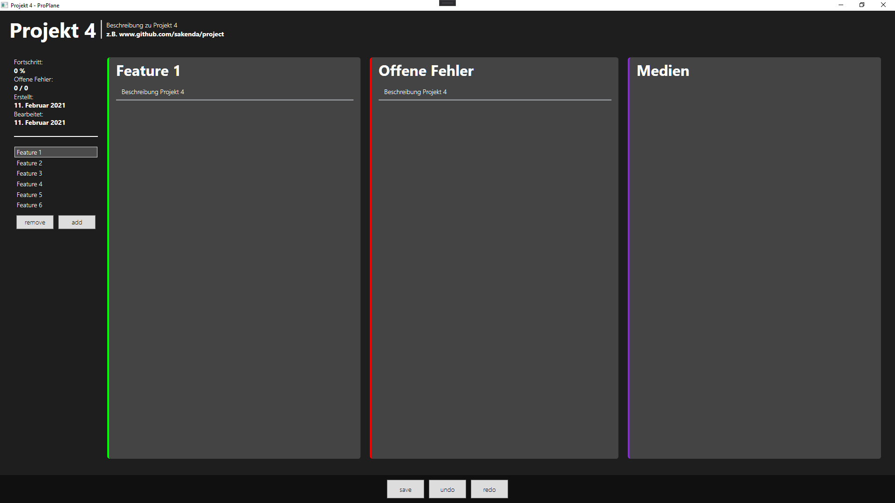

# ProPlane
Projekt Planner für eigene Software Entwicklungen

Programm zum Planen und Verwalten meiner eigenen Projekte. 
Zum erstrelease sind folgende Funktionen geplant: Feature tracking, Bug tracking und Referenzmaterialien.

## User Interface (Work in Progress)

## Über Mich
Michael Barth
Software Entwickler
sakenda1207@gmail.com
